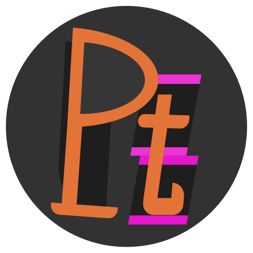

# pt / libpt

`pt` stands for either one of "personal tool", "plex tool", "pete" or something among those lines.
It is a collection of tools that i might or might not use. The intended purpose of this repo is that
I program whatever i feel is worth having in a personal thing into it, then use it as either a lib,
crate, python module or executable.

Let's see if I make it a bloated mess or stop committing after 30 hello worlds.

* [Original Repository](https://git.cscherr.de/PlexSheep/pt)
* [GitHub Mirror](https://github.com/PlexSheep/pt)
* [Codeberg Mirror](https://codeberg.org/PlexSheep/pt)
* [crates.io](https://crates.io/crates/libpt)
* [docs.rs](https://docs.rs/crate/libpt/)

## Dependencies

- See `cargo.toml`
- [openssl bindings for rust](https://docs.rs/openssl/latest/openssl/)
- [Python](https://www.python.org/)
- [`maturin`](https://maturin.rs) - `pip install maturin`

## Compiling & Installing from source

If you only want the rust library, you can simply build it with `cargo build`. Add it to your
project like any other local dependency.

If you want to use the python variant too, you need to compile with maturing.

- Install in `venv`: `maturin develop --release`
- Install in system: `maturin build --release && pip install target/wheels/libpt-x.x.x-*`

## Installing from [pypi](https://pypi.org)

`libpt` has been packaged for [pypi.org](https://pypi.org/project/libpt/).

You can install it with `pip install libpt`

## Installing from [crates.io](https://crates.io)

`libpt` has been packaged for [crates.io](https://crates.io/crates/libpt).

You can add the library to your project with `cargo add libpt`.

## Installing from my personal package registry

`libpt` has been packaged for [git.cscherr.de](https://git.cscherr.de).

You can add the registry to your `config.toml` and then `cargo add libpt`

[Package](https://git.cscherr.de/PlexSheep/-/packages/cargo/libpt/)

## Testing

Testing needs to be done separately for the rust and python parts:

- Rust testing with `cargo test`
- Python testing with `./scripts/pytests.sh` or `python -m unittest discover -fs tests/python`

## Documentation

The documentation can be automatically generated with `cargo doc --open`.

An up to date version of the Documentation can be found [here](https://docs.rs/libpt/)

## License

**Pt is MIT Licensed**
